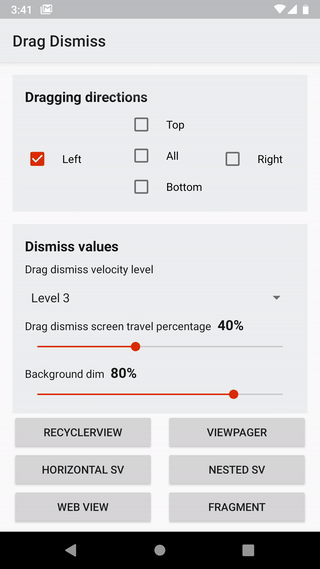

# DragDismiss
[](https://developer.android.com/index.html)

[](http://www.apache.org/licenses/LICENSE-2.0)

Many studies and surveys showed that users prefer dragging and swiping to clicking...

DragDismissLayout is a ViewGroup, Built using the ViewDragHelper utility class, Developed to help you give your users the flexibility of dragging to dismiss visible screen.



- We support all types of views static and scrolling horizontally or vertically.
- Works with activities and fragments.
- Works with activities and fragments.
- Built using androidx ViewDragHelper utility class.
- Kotlin-Idiomatic, written completely in kotlin.

# How to use DragDismiss
**Firstly,** you will have to use `Theme.DragDismiss` as your activity's theme
```xml
<activity
    android:name=".ActivityName"
    android:theme="@style/DragDismissTheme" />
```
Or add these to your existing Theme for activities that implement DragDismiss
```xml
<item name="android:windowFullscreen">true</item>
<item name="android:windowIsTranslucent">true</item>
<item name="android:windowBackground">@android:color/transparent</item>
```
**Then,** You can set the DragDismiss directly from your onCreate method like below
```kotlin
override fun onCreate(savedInstanceState: Bundle?) {
    super.onCreate(savedInstanceState)
    DragDismiss.create(mContext)
        .attach(this, R.layout.activity_layout_name)
}
```
**Note** `setContentView()` is not set.


**Custmizations,** For extra custmizations for your DragDismissLayout check below.
```kotlin
DragDismiss.create(mContext)
    .setDragDismissScreenPercentage(0.5f)
    .setDragDismissVelocityLevel(DragDismissVelocityLevel.LEVEL_3)
    .setShouldDragEdgeOnly(false)
    .setDragDismissDraggingDirections(DragDismissDirections.DIRECTION_FROM_LEFT or DragDismissDirections.DIRECTION_FROM_RIGHT)
    .setDragDismissBackgroundAlpha(0.8f)
    .attach(this, R.layout.activity_layout_name)
```
You can learn more and play around with the attrs in the sample by cloning the repo.

# Contribute
Contributions and contributors are always welcome!, Help us make DragDismiss better and give back to the community.

Found an issue or feel like contributing? Please use [Github][issues]  
Have a question? Please use Stackoverflow with tag [DragDismissLayout][stackoverflow]

# License
    Copyright 2020-present Link Development

    Licensed under the Apache License, Version 2.0 (the "License");
    you may not use this file except in compliance with the License.
    You may obtain a copy of the License at

        http://www.apache.org/licenses/LICENSE-2.0

    Unless required by applicable law or agreed to in writing, software
    distributed under the License is distributed on an "AS IS" BASIS,
    WITHOUT WARRANTIES OR CONDITIONS OF ANY KIND, either express or implied.
    See the License for the specific language governing permissions and
    limitations under the License.

 [issues]: https://github.com/DragDismissLayout/issues
 [stackoverflow]: http://stackoverflow.com/questions/tagged/DragDismissLayout
 